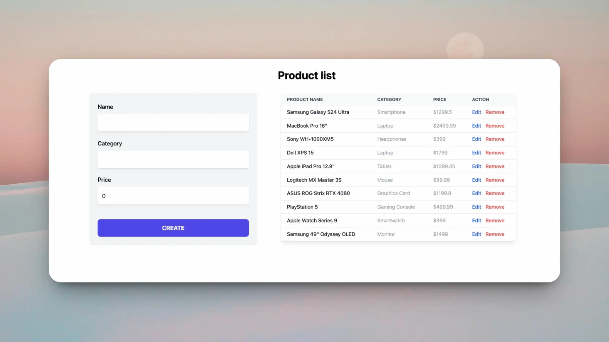

# Full-Stack Product List Application

This is a full-stack project for managing a product list, developed with a **Spring Boot** backend and a **React (TypeScript)** frontend.

## Preview



## Technologies Used

- **Backend:**
  - Java 23
  - Spring Boot 3.4.0
  - Spring Data REST (JPA)
  - MySQL
- **Frontend:**
  - React 18
  - TypeScript
  - Vite
  - Tailwind CSS

---

## Prerequisites

Make sure you have the following installed:
- [Java JDK 23](https://www.oracle.com/java/technologies/downloads/)
- [Node.js](https://nodejs.org/) (LTS version recommended)
- [MySQL Server](https://www.mysql.com/downloads/)
- A package manager like `npm` (included with Node.js)

---

## Configuration and Setup

### 1. Backend (Spring Boot)

The backend uses **Spring Data REST** to automatically expose endpoints for the `Product` entity.

#### Database Configuration
You need to create a MySQL database (e.g., named `product_db`) and configure the credentials in the backend. 

*Note: If the `src/main/resources` folder does not exist, create it and add the `application.properties` file.*

Create the file `backend-products/src/main/resources/application.properties` with the following content:

```properties
spring.application.name=backend-products

# MySQL Configuration
spring.datasource.url=jdbc:mysql://localhost:3306/product_db?useSSL=false&serverTimezone=UTC&allowPublicKeyRetrieval=true
spring.datasource.username=your_username
spring.datasource.password=your_password
spring.datasource.driver-class-name=com.mysql.cj.jdbc.Driver

# JPA / Hibernate
spring.jpa.hibernate.ddl-auto=update
spring.jpa.show-sql=true
spring.jpa.properties.hibernate.dialect=org.hibernate.dialect.MySQLDialect

# Server Port
server.port=8080
```

#### Running the Backend
From the project root folder or from `backend-products/`:

```bash
cd backend-products
./mvnw spring-boot:run
```
The server will start at `http://localhost:8080`.

### 2. Frontend (React + Vite)

The frontend connects to the backend on port `8080` and expects the development server to run on port `5173`.

#### Dependency Installation
From the `frontend-products` folder:

```bash
cd frontend-products
npm install
```

#### Running the Frontend
```bash
npm run dev
```
The application will be available at `http://localhost:5173`.

---

## Project Structure

- `backend-products/`: Source code for the REST API with Spring Boot.
- `frontend-products/`: Client application in React.
  - `src/components/`: Reusable components.
  - `src/context/`: Global state management with Context API.
  - `src/services/`: Services for backend communication.
  - `public/`: Public assets, including the sample screenshot.
